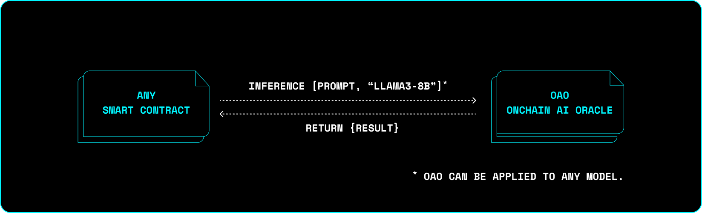

# Web3.js ORA Plugin


This is a [web3.js](https://github.com/web3/web3.js) `4.x` plugin for interacting with ORA Ethereum contracts.

## Prerequisites

- :gear: [NodeJS](https://nodejs.org/) (LTS/Fermium)
- :toolbox: [Yarn](https://yarnpkg.com/)

## Installation

```bash
yarn add web3
```

Or

```bash
npm i web3
```

```bash
yarn add @ora-io/web3-plugin-ora
```

Or

```bash
npm i @ora-io/web3-plugin-ora
```

## Getting started

To interact with ORA's web3js plugin you need to follow next steps:

1. Register ORA plugin to web3.js context
2. Add wallet to web3.js context, in order to sign blockchain transactions
3. Estimate fee for the OAO callback (`estimateFee`)
4. Initiate inference request (`calculateAIResult`)
5. Check the inference result (`getAIResult`)

This section will help you get started with utilizing OAO in your smart contracts. In depth tutorial on how to interact with ORA's Onchain AI Oracle can be found [here](https://docs.ora.io/doc/oao-onchain-ai-oracle/develop-guide/tutorials/interaction-with-oao-tutorial).

In this example we will interact with the ORA contract deployed in the Sepolia network.

:::Info
[here](https://github.com/ora-io/web3.js-plugin-ora/blob/master/src/types.ts) you can find other available networks
:::

```ts
import { Web3 } from "web3";
import { Models, ORAPlugin, PromptAddresses } from "@ora-io/web3-plugin-ora";

// Initialize RPC endpoint (in this case with Sepolia Testnet)
const web3 = new Web3("https://1rpc.io/sepolia");

// Step 1: Register the ORAPlugin to the web3.js context pointint to the Sepolia Testnet network
web3.registerPlugin(new ORAPlugin(PromptAddresses.SEPOLIA));

// Step 2: Add private key to initialize a wallet
const wallet = web3.eth.accounts.wallet.add("PRIVATE_KEY"); // Make sure you have funds

async function main() {
  const PROMPT = "Generate image of an eagle that explores the world";

  // Step 3: Estimate fee
  const estimatedFee = await web3.ora.estimateFee(Models.STABLE_DIFFUSION);
  console.log("Estimated fee: ", estimatedFee);
  //→ Estimated fee:  14842518431500000n

  // Step 4: Initiate inference request
  const tx = await web3.ora.calculateAIResult(wallet[0].address, Models.STABLE_DIFFUSION, PROMPT, estimatedFee);
  //console.log(tx);
  //→ Transaction receipt

  // Step 5: Fetch the result
  const result = await web3.ora.getAIResult(Models.STABLE_DIFFUSION, PROMPT);
  console.log("Inference result: ", result);
  //→ Inference result:  QmQkxg31E9b8mCMAW8j2LYB46LM8ghExbXrQHob26WLos1
}

main();
```

In this example we interacted with `STABLE_DIFFUSION` model, hence the result is a [CID](https://pinata.cloud/blog/what-is-an-ipfs-cid/#:~:text=The%20CID%20is%20a%20unique,%2C%20such%20as%20SHA%2D256.) of an image stored on ipfs. You can check generated image here: https://ipfs.io/ipfs/QmQkxg31E9b8mCMAW8j2LYB46LM8ghExbXrQHob26WLos1

You can experiment by changing modelId and prompt to get different inferences from all supported models.

## Introduction to Onchain AI Oracle (OAO)

Onchain AI Oracle (OAO) is the ORA's verifiable and decentralized AI oracle. Smart contracts can request an AI inference from OAO, and it will return a verifiable result. Different AI models are integrated into the oracle nodes. When interacting with OAO, users need to specify id of the model they are willing to interact with. The result will vary depending on the model used (eg. Stable-Diffusion generates image, while Llama3 generates text result).

- You can check all supported models in the [documentation](https://docs.ora.io/doc/oao-onchain-ai-oracle/reference)
- To understand why verifiability matters, check out this [page](https://docs.ora.io/doc/oao-onchain-ai-oracle/introduction/why-verifiability-matters)
- To explore existing AI powered dapps and use cases visit [awesome-ora](https://github.com/ora-io/awesome-ora)



## Plugin Methods

ORAPlugin supports method for getting AI inference results from all supported chains. When interacting with the plugin, users need to specify which chain to interact with.

### `estimateFee`

`estimateFee` method is used to determine amount of wei necessary for oracle to execute callback and return inference result. Estimated fee is passed as a value for `calculateAIResult` function call.

```typescript
/**
 * @param modelId specifies AI model for fee estimation
 */

web3.ora.estimateFee(modelId: Models)
// => Returns BigInt
```

### `calculateAIResult`

`calculateAIResult` interacts with Onchain AI Oracle (OAO), requesting AI inference.

```typescript
/**
 * @param from specifies the sender of the transaction (connected wallet address)
 * @param modelId id of the AI model that should be called
 * @param prompt custom prompt for inference request
 * @param estimatedFee result of `estimateFee` method
 */

await web3.ora.calculateAIResult(wallet[0].address, Models.STABLE_DIFFUSION, PROMPT, estimatedFee);
// => Returns Transaction receipt
```

### `getAIResult`

`getAIResult` is used to query inference result for the specific prompt and modelId.

```typescript
/**
 * @param modelId speficies the AI model which will return inference results
 * @param prompt user prompt string for the inference call
 */

const result = await web3.ora.getAIResult(Models.STABLE_DIFFUSION, PROMPT);
// => Returns String with the ORA AI result
```

Under the hood, this method is calling the `getAIResult` function on the `Prompt` contract for the specified model and prompt.

## Useful links

- [web3.js Documentation](https://docs.web3js.org/)
- [ORA Documentation](https://docs.ora.io/doc)
- [awesome-ora](https://github.com/ora-io/awesome-ora)

## Found an issue or have a question or suggestion

- If you found an issue or have a question or suggestion [submit an issue](https://github.com/ora-io/web3.js-plugin-ora/issues) or join us on [Discord](https://discord.gg/fg5ygkgy)
